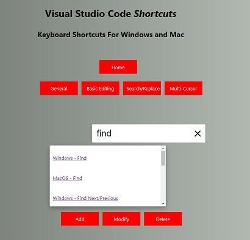
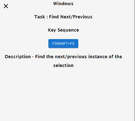
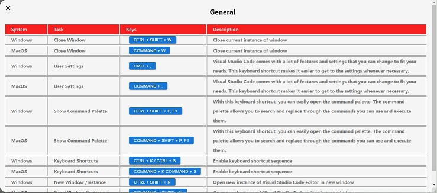
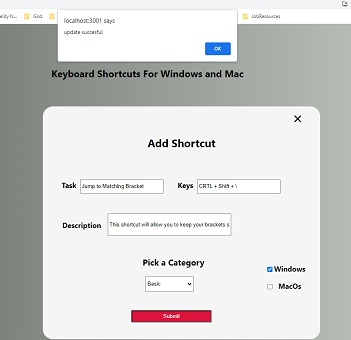
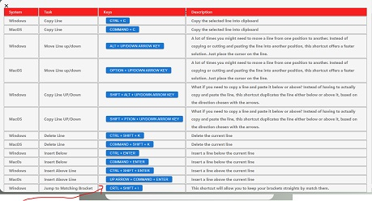
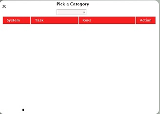
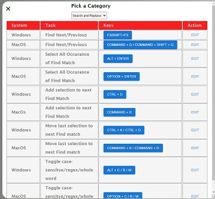
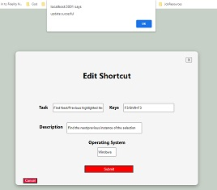
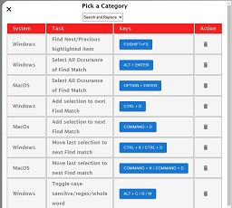

## Keyboard Shortcuts for Windows and Mac
https://flatiron-shortcutapp.netlify.app/

It has been said that *neccesity is the mother of invention*. The idea for the **VS Code Shortcuts for Windows and Mac** app was birthed from such a need. My only hope is eventually I'll be able to move around VS Code with the speed and efficiency of the development community.

## The App

**Visual Studio Code Shortcut for Window and Mac** is an app that with the click of a button will give you access to a library of keyboard shortcuts anyone can use to make their development experience more pleasurable and efficient.
## The Layout

Visual Studio Code Shortcut for Window and Mac consist of 8 buttons:
- Home
- General
- Basic Editing
- Search and Replace
- Multi-Cursor
- Add
- Modify
- Delete

## Usage
*Home* - This is where the app starts. It contains all the buttons for operation to include a *search box*. The search box allows the user to search for the key sequence for a particular task. As the user begins to type a dropdown box appears with a list of tasks matching what is being typed in the search box(Fig1).  The user can then pick a task from the list to get the key sequence along with a descripton of that task. 

(Fig1) (Fig2)

The shortcuts are broken down in to four categories represented by the following buttons:

- General 
- Basic Editing
- Search and Replace
- Multi-Cursor

Clicking on the buttons will give you list of all the shortcuts from that particular category for both Windows and MacOs.

(Fig3)

Along the bottom of the Home page are what we call *utility* buttons. These button allows the user to modify the shortcuts.

*Add* - As the name suggest, *Add* allows the user to add a shortcut to a category. When *Add* is clicked a box appears with an input box for *Task*, which is the command or task being performed, *Keys* which is the "*key sequence*" used to perform the task, a description box, a checkbox for Windows and MacOs. and a dropdown menu with a list of the categories (*see figs 4-5*).

(Fig4) (Fig5) 

 Once the information is entered, the category selected, and the box checked for either Windows or MacOs, the submit button is clicked an alert window appears with a message that the update was successful. The app then returns to the *Home* page where the user can then click the button for the category to see the updated list (*Fig6*).
 
(Fig6) 

*Modify* - Modify allows a user to edit a shortcut. When a user clicks *Modify*, *Pick a Category* appears with a dropdown menu that contains a list of categories, and a blank box(Fig1). When the user selects a category the box populates with a list of all the shortcuts for that category. Each shortcut will have either Windows or MacOs and an edit button(Fig2). When the user clicks the edit button a form pops up and is populated with the information for that shortcut(Fig3). The user can then modify the information and submit the form(Fig4). Once the form is submitted a new list appears with the updated shortcut(Fig5). Click the "X" in the top right corner to close the list and return to the Home page.

(Fig1) (Fig2) 
(Fig3) (Fig4) 
(fig5)

*Delete* - The *Delete* button gives the ability to delete a shortcut. When the *Delete* button is clicked just like with the Modify button, *Pick a Category* appears with a dropdown menu that contains a list of categories, and a blank box. When the user selects a category the box populates with all the shortcuts from that category. Each shortcut will have either Windows or MacOs and a delete button(Fig1). When the delete button is clicked the shortcut will disappear from the list(Fig2).

 (Fig2) 

## What's Next

As I grow as a FullStack Developer my plan is to complete this project by adding the rest of the categories and shortcuts. I would also like to spend some time adding styling to make it more professional looking...**stay tuned!** 

<video src="shortcuts.mp4" controls title="Title"></video>

